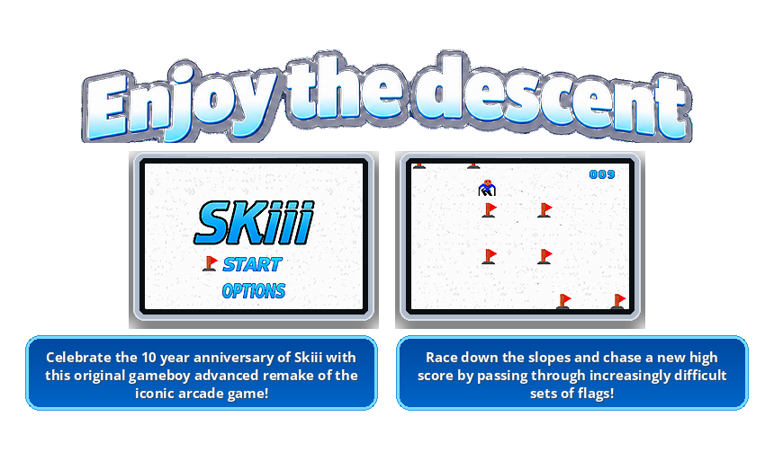

<p align="center">
  
</p>

<h1 align="center">Skiii</h1>

<p align="center"><strong>Enjoy the descent.</strong></p>

<p align="center">
  Celebrate the 10 year anniversary of Skiii with this original Game Boy Advance demake of the iconic mobile arcade game.
</p>

<p align="center">
  <a href="https://skiii.faber.build"><strong>Play online now</strong></a>
</p>

---

Race down a snow slope at 240×160. Steer a skier through gates of red flags. Each clean pass adds to the score. Miss a gate and the run is over. The flags come faster the longer you stay on your feet. Beat the high score that the cartridge remembers.

This repo is the GBA ROM that powers that run. The same ROM also plays in a browser at [skiii.faber.build](https://skiii.faber.build).

## How to play

| Control | Action |
| --- | --- |
| D-pad Left / Right, or L / R | Change lane |
| D-pad Up / Down | Move the menu cursor |
| A | Start a run, confirm a menu item, or try again on the results screen |
| B | Leave the results screen and return to the menu |

There are three lanes. Flag pairs spawn in one of those lanes. Steer so the skier is inside the gap when the flags reach you. Score ticks up. Every 10 points plays a different sound. After each new gate, the spawn interval shrinks until it hits a floor. Go for the highest score you can!

## Where to play

**In a browser (no install):** [Play online now](https://skiii.faber.build)

**On a GBA emulator:** build or use `Skiii-gba.gba` and open it in an eumlator like [mGBA](https://mgba.io/).

**On hardware:** flash `Skiii-gba.gba` to a GBA flash cart. High score save uses Flash 1M (`FLASH1M_V103`).

## Repository layout

```
Skiii-gba/
├── source/       Game C: loop, states, gameplay, UI, save, music
├── graphics/     PNG art plus grit recipes that become GBA tiles
├── sounds/       WAV sound effects (MaxMod soundbank)
├── build/        Intermediate objects, grit output, soundbank
├── docs/         README art
├── Makefile      devkitARM / libtonc / maxmod build
├── remake.ps1    Windows rebuild + launch in mGBA
└── Skiii-gba.gba Output ROM
```

### Runtime architecture

`source/skiii.c` is the entry point and the main loop. After boot it sits on VBlank, mixes audio, scrolls the snow background, and dispatches on a `ProgramState`:

`MENU` → `OPTIONS` → `SKI` → `RESULTS`

| File | Role |
| --- | --- |
| `skiii.c` / `skiii.h` | `main()`, VBlank loop, state enum, start and results animations |
| `boot_loader.c` | Load palettes, tiles, maps, and sprites into VRAM. Owns the GBA memory map for backgrounds and objects |
| `ui_manager.c` | Show and hide layers and sprites for each state. Builds the menu node graph |
| `menu_navigation_manager.c` | Linked `MenuNode` cursor. Up/Down/A walk and fire `select()` |
| `game_logic.c` | Lane movement, input buffer, flag spawn, collision, speed-up, score vs game-over |
| `save_to_gba.c` | Flash 1M high score. Magic string `SKIII`, little-endian score |
| `music.c` | Title/in-game theme on GBA PSG (square, wave, noise) at 159 BPM |
| MaxMod + `sounds/` | One-shot SFX: turn, point, and every-10-points sting |

Graphics go through **grit**. Each PNG in `graphics/` has a matching `.grit` file. The Makefile turns those into `.s` / `.h` tile data in `build/`. Audio WAVs go through **mmutil** into `soundbank.bin`. Music is not a sample bank; it is note data on the GBA sound chip, kept separate from MaxMod DirectSound so the two mixers do not overwrite each other.

Boot maps VRAM roughly like this (see the comment at the top of `boot_loader.c` for the full table):

- BG0 — scrolling snow floor
- BG1 — Skiii logo on the title screen
- BG2 — TTE text (score, options, results)
- BG3 — results overlay
- OBJ — start/options labels, flag cursor, skier frames, live flag gates

### Build

You need [devkitARM](https://devkitpro.org/) with libgba, libtonc, and maxmod. `DEVKITARM` must be set.

```sh
make
```

That writes `Skiii-gba.elf` and `Skiii-gba.gba`.

## Credits

- **Tom Runnels** — Game & Programming
- [**Mellusi**](https://open.spotify.com/artist/4E0n6Cr7nsTLzh1D3XbepW?si=Z4yuGro1R6KnAMwaypa7Fg) — music

GBA libraries: [libtonc](https://www.coranac.com/tonc/text/toc.htm), [MaxMod](https://maxmod.devkitpro.org/), grit, mmutil.
